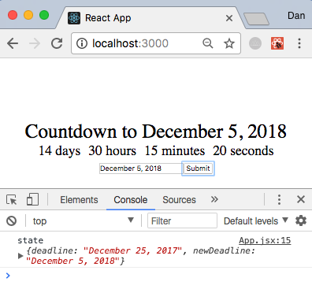
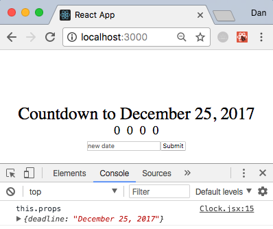

## REACT: Building a countdown timer

This app is based upon a Udemy course found [here](https://www.udemy.com/react-js-and-redux-mastering-web-apps/learn/v4/overview) but with an expanded description of the `React` basics.

We will assume two things:
1. You have created a repository on GitHub and cloned to local folder, possibly called `countdown`.
2. `npm` + `react` are installed

It is not necessary with simple apps, but as a rule I tend to make a `git branch` called `development` in order to protect the sacrosanct `master branch`.
```
git branch development
git checkout development
```
We can use the custom `React` command to build a simple functioning React app that we will then strip out and rebuild in as a countdown timer.
```
create-react-app countdown_champ
cd countdown_champ
```
This command will create the app `countdown_champ` and produce multiple files in the app directory.

Delete all files in `countdown_champ/src` folder.

Make a new, blank `index.js` file in the now empty `src` folder.

Our pre-made `index.html` file resides in the `public` folder and looks like this. Note the `div` with the `id="root"`. Our app will made in other files but will rendered in its entirety through this `root div`.

```html
<!DOCTYPE html>
<html lang="en">
  <head>
    <meta charset="utf-8">
    <meta name="viewport" content="width=device-width, initial-scale=1, shrink-to-fit=no">
    <meta name="theme-color" content="#000000">

    <!--
Only files inside the `public` folder can be referenced from the HTML.
    -->
    <link rel="manifest" href="%PUBLIC_URL%/manifest.json">
    <link rel="shortcut icon" href="%PUBLIC_URL%/favicon.ico">

    <title>React App</title>
  </head>
  <body>
    <noscript>
      You need to enable JavaScript to run this app.
    </noscript>
    <div id="root"></div>

  </body>
</html>
```

Lets make a new `index.js` file and insert the following. The code is annotated to show the relevance of each line.

```js
// import react library
import React from 'react';

// puts react code onto browser
import ReactDOM from 'react-dom';

// where shall we render the element?
// use the div in public/index.html with id="root"
ReactDOM.render(
  <div>countdown champ</div>, document.getElementById('root')
);
```

If we open a browser and navigate tp The `localhost:3000` we should see our words "countdown champ" rendered.


### First component
Make a new file in `src` called `App.jsx`.
'JSX' is used to create elements and components in React. A component is an independent and reusable piece of UI. importing and exporting allows us to share code between modules and files.

`App.jsx`
```js
import React, { Component } from 'react';

//  This extension of Component class allows us to use all of Component's methods
// always "return" the jsx
class App extends Component {
  render () {
    return (
      <div>CountDown Champ, App Component</div>
    );
  }
}

// can now export it to other classes that can import it
export default App;
```

Back in `html` we can now excise the div we had rendered as...
```js
  <div>CountDown Champ, App Component</div>
```

... and we can now replace it with our `App` component exported from `App.jsx` and imported and rendered as such...

```js
// import react lib
import React from 'react';

// puts react code onto browser
import ReactDOM from 'react-dom';

// import App Component from current directory.
import App from './App';

// where shall we render the element?
// use the div in public/index.html with id="root"
// divs with no inner children can self enclose
ReactDOM.render(
  <App />, document.getElementById('root')
);
```
And we get this poor looking effort.


It doesn't look good yet. But we can add some more template `jsx` to the `app` component and some `css` styling.

```js
import React, { Component } from 'react';
import './App.css';

class App extends Component {
  render () {
    return (
      <div className='App'>
        <div className='App-title'>Countdown to December 25, 2017</div>
        <div>
          <div className='Clock-days'>14 days</div>
          <div className='Clock-hours'>30 hours</div>
          <div className='Clock-minutes'>15 minutes</div>
          <div className='Clock-seconds'>20 seconds</div>
        </div>
        <div>
          <input placeholder='new date' />
          <button>Submit</button>
        </div>
      </div>
    );
  }
}

export default App;
```

`App.css`
```css
.App {
  text-align: center;
  font-size: 35px;
  margin-top: 20%;
}

.App-title {
  font-size: 50px;
}

.Clock-days, .Clock-hours, .Clock-minutes, .Clock-seconds {
  display: inline;
  margin: 10px;
}
```


### Props and State

`State` endows the components with reactivity... Each `Component` has its own local `state` with respect to the global state of the entire app.
We need to add a `constructor()` function to any `Components` that require local `state` within their `class`. Literal objects are made of `key:value` pairs.
eg,
```js
var b = {
  x: 100,
  y: 50,
  display: function() {
    console.log(x, y)
  }
}
```
If we wish to refer to `properties` such as `x` of `literal objects` we use `this.x`.

We can use the `constructor()` in our `Component class` to make new `objects`. Any properties specific to that `object` will be defined with the word `this`. We can customize `Components` by adding the parameter `props` to the `constructor()` and `super()` methods although it can be called anything, not just `props`. By using `props` in this manner 'props' then becomes assigned to `this`.

1. `constructor()`
  - `constructor()` is not necessary inside a `component`, however, it is useful for creating objects. We could simply use an objectless `component` to return something like `<div>This is a div</div>` without necessitating a `constructor`. However, `constructor()` is necessary to create and initialize an `object` within a `class`.
2. `super()`
  - `Super()`, on the other hand, is necessary if we wish to set a property such as this inside the `constructor`. If employ `super()` then we can call `this` in various places of our app (avoiding `'this is not allowed before super()'` error).
3. `super(props)`
  - If we then wish to access the `props` in the `constructor` of a `class` then we need to call `super(props)`. The error resulting from `props` absence in the `super()` argument being `<var> is undefined`.

We now add a `state` property to our `Component`. `State` is always an `object`. `Objects` have `keys` that map to `values` and these `values` can be any valid `JavaScript` type, `strings`, `numbers`, or other `objects` etc...
`State` is usually initialized in the `constructor()` in such a manner:
```js
this.state = {object key: object value};
```

To change the change the `value` we call
```js
this.setState = {object key: object newValue};
```

In our `App.jsx` we define the state with the `key` `deadline` and `value` of `December 25th, 2017` and then insert the variable into the `render()` function.

```js
...
// Add constructor, with props, initialize the state
class App extends Component {
  constructor (props) {
    super(props);
    this.state = {
      deadline: 'December 25, 2017'
    };
  }
  // refer to variable deadline in app
  render () {
    return (
      <div className='App'>
        <div className='App-title'>Countdown to {this.state.deadline}</div>
        <div>
          ...
      )
  }
}      
```
To set the `state` we need to make a `method` in the `class` that updates the `state`. Never mutate or change state directly. ie, we do not merely 'add' a day to our current day of '25th December', to make '26th of December'. We actually redefine the entire `object`.

```js
changeVariable () {
  this.setState({
    key: newValue
  });
}
```

In our case we add the following to `App.jsx`.
```js
// our change state class method
changeDeadline () {
  this.setState({
    deadline: 'November 25, 2017'
  });
}
```
Furthermore, we can now augment our button element in `App.jsx` to fire the `changeDeadline()` function on mouse click.
```js
<button onClick={() => this.changeDeadline()}>Submit</button>
```
What is this arrow `=>` function above?
1. Arrow functions are smaller, inline and single purpose.
2. They allow us to avoid using `function`, `return` and `{}`. Thus, `parameter => expression`.
3. Arrow functions allow for anonymous functions to take in `this` from outside of the function. Previously, `this` was not available inside functions of your JavaScript class.

Having added the `changeDeadline()` method to the `Component` and added it to the `submit button` functionality we can now toggle the `submit button` and see the countdown title change from 'December 25' to 'November 25'.

We can take in user input from the `new date` text box, and, show it off in the console with the arrow function that produces a variable called `event` each time a letter is typed into the input box and we can `console.log()` the string 'event' and the properties of `event.target.value`.
```js
<input placeholder='new date' onChange={event => console.log('event', event.target.value)}
```


So, we have demonstrated that we can receive the user input as the `event` and `console.log()` it, how about receive the input and use it to set the new state of the deadline? Well, as mentioned above, we do not change/mutate the existing deadline object. We set a new state by simply making a new deadline object. So, in our `App.jsx` we refactor our XML `<input>` and our `changeDeadline()` method in the following manner:
```js
import React, { Component } from 'react';

import './App.css';

class App extends Component {
  constructor (props) {
    super(props);
    this.state = {
      deadline: 'December 25, 2017',
      newDeadline: ''
    };
  }

  // change the state to newDeadline received from XML input element below
  changeDeadline () {
    this.setState({deadline: this.state.newDeadline});
  }

  // 1. input assigns its event.target.value from user input to variable 'newDeadline'
  // 2. on submission the deadline function triggered and sets a new state equal to the newDeadline
  render () {
    return (
      <div className='App'>
        <div className='App-title'>Countdown to {this.state.deadline}</div>
        <div>
          <div className='Clock-days'>14 days</div>
          <div className='Clock-hours'>30 hours</div>
          <div className='Clock-minutes'>15 minutes</div>
          <div className='Clock-seconds'>20 seconds</div>
        </div>
        <div>
          <input placeholder='new date' onChange={event => this.setState({newDeadline: event.target.value})} />
          <button onClick={() => this.changeDeadline()}>Submit</button>
        </div>
      </div>
    );
  }
}

export default App;
```


So, we can change the deadline to the newDeadline with `setState`. But now we need to write some logic to take in the user input and apply it to the clock/countdown function which we will do in a seperate `Clock.jsx` file. We can then import the `Clock` Component to our `App.jsx` at the expense of the previously existing `divs`.

Additionally, We need a way for the `Clock Component` to realize the date set within the application (the `Parent Component`). `Props` refers to some data within the application, and wiith `props` we pass `data` or `state` to `Child Components` from `Parent Components`.

For example, if a `deadline` was specified within the `App.jsx` we can pass this data through as `props ` to the Child Clock Component.

The relevent files and display on the local server now look like this:
`App.jsx`
```js
import React, { Component } from 'react';
import Clock from './Clock';
import './App.css';

// deadline defined here and assigned to props
class App extends Component {
  constructor (props) {
    super(props);
    this.state = {
      deadline: 'December 25, 2017',
      newDeadline: ''
    };
  }

  changeDeadline () {
    console.log('state', this.state);
    this.setState({deadline: this.state.newDeadline});
  }

  // replaced all divs with Clock component
  // added the current deadline to Parent App which will pass to Child Clock.jsx
  // Clock.jsx will see this deadline as props
  render () {
    return (
      <div className='App'>
        <div className='App-title'>
        Countdown to {this.state.deadline}
        </div>
        <Clock
          deadline={this.state.deadline} />
        <div>
          <input placeholder='new date' onChange={event => this.setState({newDeadline: event.target.value})} />
          <button onClick={() => this.changeDeadline()}>Submit</button>
        </div>
      </div>
    );
  }
}

export default App;
```

```js
import React, { Component } from 'react';
import './App.css';

class Clock extends Component {
  constructor(props){
    super(props);
    // declare some initial state for following variables
    this.state = {
      days: 0,
      hours: 0,
      minutes: 0,
      seconds: 0
    }
    // we can view the props from the parent Component App in this Child Component Clock.jsx
    console.log('this.props', this.props);
  }

  // state is all zeros as above
  render () {
    return (
      <div>
        <div className='Clock-days'>{this.state.days}</div>
        <div className='Clock-hours'>{this.state.hours}</div>
        <div className='Clock-minutes'>{this.state.minutes}</div>
        <div className='Clock-seconds'>{this.state.seconds}</div>
      </div>
    );
  }
}

export default Clock;
```
Note the `deadline` variable here is rendered in the browser due to a `console.log()` statement written in the `Child Clock Component` taking in the argument `this.props` defined in the `Parent App Component`



### A method to calculate the time from past deadline to current time.

JavaScript comes with a useful date object with a large amount of functionality.

We will add this function to the `Clock.jsx Component` above the `render()` function.
We use `let` or `const` in ES6 depending upon whether variables need updating or not.

The countdown equation is as follows:

_time = deadline (future) - current time_

Our `Clock.jsx `is modified thusly:
```js
...
getTimeUntil (deadline) {
  const time = Date.parse(deadline) - Date.parse(new Date());
  console.log('time', time);
}

render () {
  this.getTimeUntil(this.props.deadline);
  ...
}
```

And our browser displays the `time`, in seconds to our `deadline`.


We have an answer for our countdown of 227300600 seconds. We now need to put this into a more usable format in `Clock.jsx`.

```js
getTimeUntil (deadline) {
  const time = Date.parse(deadline) - Date.parse(new Date());
  console.log('time', time);
  const seconds = Math.floor((time / 1000) % 60);
  const minutes = Math.floor((time / 1000 / 60) % 60);
  const hours = Math.floor(time / (1000 * 60 * 60) % 24);
  const days = Math.floor(time / (1000 * 60 * 60 * 24) % 60);

  console.log('days', days, 'hours', hours, 'minutes', minutes, 'seconds', seconds);
}
```
Here we can see the time is correctly console logged.


### Mounting/Unmounting
In React mounting and unmounting refer to the process by which a Component renders to the screen or is removed from the screen. React provides special methods to take care of these processes called `Life Cycle Hooks`.

The `componentWillMount` hook runs before the Component completely renders to the application. It is used as need to calculate countdown data (days/hours/minutes/seconds) based upon `props` prior to rendering. Once we have our data we will update our application.
```js
// get data prior to mounting
componentWillMount () {
  this.getTimeUntil(this.props.deadline);
}
```

The `componentDidMount` hook runs after the `Component` has completely rendered to the application. We can call `getTimeUntil()` every second (using `setInterval()`, a JavaScript built-in function) to continually update our countdown timer.

```js
// continually get data after mounting
componentDidMount () {
  setInterval(() => this.getTimeUntil(this.props.deadline), 1000);
}
```

In addition, we can do two more things:

1. Leading zero helper method using a ternary expression.
Return the the number itself... if it is < 10 return the 0 string plus the number, if not just return the number.
```js
// Add leading 0 to values below 10
leading0 (num) {
  return num < 10 ? '0' + num : num;
}
```

Our final `Clock.jsx` now looks like this!
```js
import React, { Component } from 'react';
import './App.css';

class Clock extends Component {
  constructor (props) {
    super(props);
    // declare some initial state for following variables
    this.state = {
      days: 0,
      hours: 0,
      minutes: 0,
      seconds: 0
    };
  }

  // get data prior to mounting
  componentWillMount () {
    this.getTimeUntil(this.props.deadline);
  }

  // continually get data after mounting
  componentDidMount () {
    setInterval(() => this.getTimeUntil(this.props.deadline), 1000);
  }

  // Add leading 0 to values below 10
  leading0 (num) {
    return num < 10 ? '0' + num : num;
  }

  getTimeUntil (deadline) {
    const time = Date.parse(deadline) - Date.parse(new Date());
    const seconds = Math.floor((time / 1000) % 60);
    const minutes = Math.floor((time / 1000 / 60) % 60);
    const hours = Math.floor(time / (1000 * 60 * 60) % 24);
    const days = Math.floor(time / (1000 * 60 * 60 * 24));

    this.setState({days, hours, minutes, seconds});
  }

  render () {
    return (
      <div>
        <div className='Clock-days'>{this.leading0(this.state.days)}</div>
        <div className='Clock-hours'>{this.leading0(this.state.hours)}</div>
        <div className='Clock-minutes'>{this.leading0(this.state.minutes)}</div>
        <div className='Clock-seconds'>{this.leading0(this.state.seconds)}</div>
      </div>
    );
  }
}

export default Clock;
```

2. Styling with React bootstrap
Open the react-bootstrap web page [here](https://react-bootstrap.github.io/getting-started.html).

In the command line:

`npm install react-bootstrap --save`

Copy and paste into our `index.html` prior to the `<title>` the minified css file link from the web page.

In our `App.jsx` we will now import several things from react-bootsrap and apply them...


Our final `App.jsx` looks like this!
```js
import React, { Component } from 'react';
import Clock from './Clock';
import './App.css';
// import from react-bootstrap
import { Form, FormControl, Button } from 'react-bootstrap';

class App extends Component {
  constructor (props) {
    super(props);
    this.state = {
      deadline: 'December 25, 2017',
      newDeadline: ''
    };
  }

  changeDeadline () {
    console.log('state', this.state);
    this.setState({deadline: this.state.newDeadline});
  }

  // change divs to react-bootstrap Form, FormControl, Button
  // Form inline={true}
  render () {
    return (
      <div className='App'>
        <div className='App-title'>
        Countdown to {this.state.deadline}
        </div>
        <Clock
          deadline={this.state.deadline} />
        <Form inline>
          <FormControl className='Deadline-input' placeholder='new date' onChange={event => this.setState({newDeadline: event.target.value})} />
          <Button onClick={() => this.changeDeadline()}>Submit</Button>
        </Form>
      </div>
    );
  }
}

export default App;
```

And in our `App.css` we add
```css
.Deadline-input {
  font-size: 25px;
  margin: 5px;
}
```
Our countdown clock (to my birthday) should now be ticking in `localhost:3000`.


